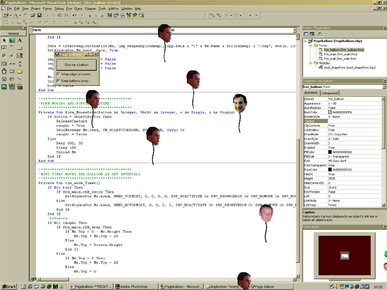



## Page Balloon \*\*Now with API timer\*\*

### Description

Hey I have changed Pageballoon by using API timers instead of widgets. I have found that they are much much faster and don't corrupt the balloons when you have many of them on the screen. Check it out, its quite fun, you can even put your ""mates"" head on one, which is nice!
 
### More Info
 

             |
---                |---
**Submitted On**   |2001-07-29 12:39:28
**By**             |[Niknak\!\!](https://github.com/Planet-Source-Code/PSCIndex/blob/master/ByAuthor/niknak.md)
**Level**          |Advanced
**User Rating**    |4.8 (24 globes from 5 users)
**Compatibility**  |VB 6\.0
**Category**       |[Jokes/ Humor](https://github.com/Planet-Source-Code/PSCIndex/blob/master/ByCategory/jokes-humor__1-40.md)
**World**          |[Visual Basic](https://github.com/Planet-Source-Code/PSCIndex/blob/master/ByWorld/visual-basic.md)
**Archive File**   |[Page Ballo237097292001\.zip](https://github.com/Planet-Source-Code/niknak-page-balloon-now-with-api-timer__1-25625/archive/master.zip)

